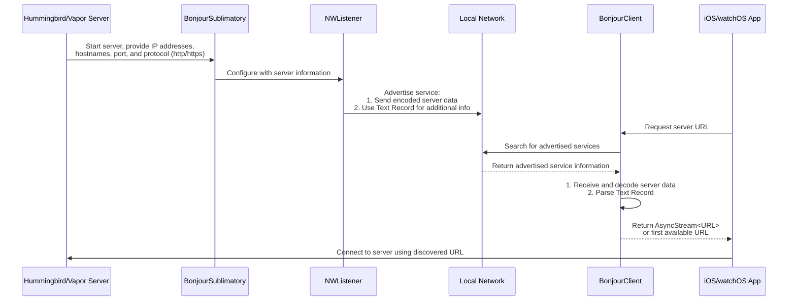

# SublimationBonjour

Use Bonjour for automatic discovery of your Swift Server.



## Overview

When the Swift Server begins it will tell Sublimation the ip addresses or host names which are available to access the server from (including the port number and whether to use https or http). This is called a `BonjourSublimatory`. The `BonjourSublimatory` then uses `NWListener` to advertise this information both by send the data encoded using Protocol Buffers as well as inside the Text Record advertised.

The iPhone or Apple Watch then uses a `BonjourClient` to fetch either an  `AsyncStream` of `URL` via `BonjourClient.urls` or simply get the `BonjourClient.first()` one available.

### Setting up your Server

Create a `BindingConfiguration` with:


* a list of host names and ip address
* port number of the server
* whether the server uses https or http

```swift
let bindingConfiguration = BindingConfiguration(
  host: ["Leo's-Mac.local", "192.168.1.10"],
  port: 8080
  isSecure: false
)
```


Create a `BonjourSublimatory` using that `BindingConfiguration` and include your server's logger. Then attach it to the `Sublimation` object:

```swift
let bonjour = BonjourSublimatory(
  bindingConfiguration: bindingConfiguration,
  logger: app.logger
)
let sublimation = Sublimation(sublimatory : bonjour)
```

You can also just create a `Sublimation` object:


```swift
let sublimation = Sublimation(
  bindingConfiguration: bindingConfiguration,
  logger: app.logger
)
```

#### Setting up your Client

On the device, create a `BonjourClient` and either get an `AsyncStream` of `URL` objects via `BonjourClient.urls` or just ask for the first one using `BonjourClient.first()`:

```swift
let client = BonjourClient(logger: app.logger)
let hostURL = await client.first()
```
