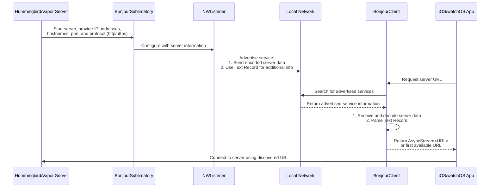

# ``SublimationBonjour``

Use Bonjour for automatic discovery of your Swift Server.

## Overview



When the Swift Server begins it will tell Sublimation the ip addresses or host names which are available to access the server from (including the port number and whether to use https or http). This is called a `BonjourSublimatory`. The `BonjourSublimatory` then uses `NWListener` to advertise this information both by send the data encoded using Protocol Buffers as well as inside the Text Record advertised.

The iPhone or Apple Watch then uses a `BonjourClient` to fetch either an `AsyncStream` of `URL` or simply get the `first` one available.

### Setting up your Server

```
let bindingConfiguration = BindingConfiguration(
  host: ["Leo's-Mac.local", "192.168.1.10"],
  port: 8080
  isSecure: false
)
let bonjour = BonjourSublimatory(
  bindingConfiguration: bindingConfiguration,
  logger: app.logger
)
let sublimation = Sublimation(sublimatory : bonjour)
```

### Setting up your Client

## Topics

### <!--@START_MENU_TOKEN@-->Group<!--@END_MENU_TOKEN@-->

- <!--@START_MENU_TOKEN@-->``Symbol``<!--@END_MENU_TOKEN@-->
