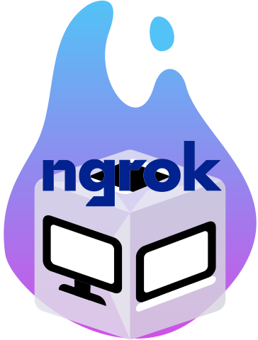
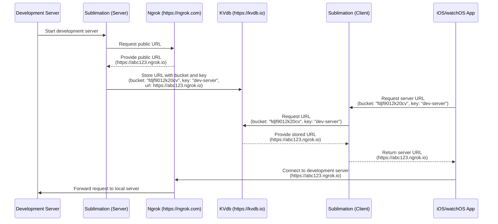

<p align="center">
    
</p>
<h1 align="center">SublimationNgrok</h1>

Share your local development server easily with your Apple devices via [Sublimation](https://github.com/brightdigit/Sublimation) and [Ngrok](https://ngrok.com).

[](https://swiftpackageindex.com/brightdigit/SublimationNgrok/documentation)
[](https://swift.org)
[](http://twitter.com/brightdigit)


[](https://swiftpackageindex.com/brightdigit/SublimationNgrok)
[](https://swiftpackageindex.com/brightdigit/SublimationNgrok)

[](https://codecov.io/gh/brightdigit/SublimationNgrok)
[](https://www.codefactor.io/repository/github/brightdigit/SublimationNgrok)
[](https://codebeat.co/projects/github-com-brightdigit-SublimationNgrok-main)
[](https://codeclimate.com/github/brightdigit/SublimationNgrok)
[](https://codeclimate.com/github/brightdigit/SublimationNgrok)
[](https://codeclimate.com/github/brightdigit/SublimationNgrok)

# Table of Contents

* [Introduction](#introduction)
  * [Requirements](#requirements)
  * [Installation](#installation)
* [Usage](#usage)
    * [Cloud Setup](#cloud-setup)
    * [Server Setup](#server-setup)
    * [Client Setup](#client-setup)
* [Documentation](#documentation)    
* [License](#license)

<!-- Created by https://github.com/ekalinin/github-markdown-toc -->


# Introduction



Ngrok is a fantastic service for setting up local development server for outside access. Let's say you need to share your local development server because you're testing on an actual device which can't access your machine via your local network. You can run `ngrok` to setup an https address which tunnels to your local development server:

```bash
> vapor run serve -p 1337
> ngrok http 1337
```
Now you'll get a message saying your vapor app is served through ngrok:

```
Forwarding https://c633-2600-1702-4050-7d30-cc59-3ffb-effa-6719.ngrok.io -> http://localhost:1337 
```

With SublimationNgrok you save the address (such as `https://c633-2600-1702-4050-7d30-cc59-3ffb-effa-6719.ngrok.io`) to a key-value storage and pull that address from your Apple device during development.

## Requirements 

**Apple Platforms**

- Xcode 16.0 or later
- Swift 6.0 or later
- iOS 17 / watchOS 10.0 / tvOS 17 / macOS 14 or later deployment targets

**Linux**

- Ubuntu 20.04 or later
- Swift 6.0 or later

## Installation

Sublimation has two components: Server and Client. You can check out the SublimationDemoApp Xcode project for an example.

To integrate **Sublimation** into your app using SPM, specify it in your Package.swift file:

```swift    
let package = Package(
  ...
  dependencies: [
    .package(url: "https://github.com/brightdigit/SublimationNgrok.git", from: "1.0.0")
  ],
  targets: [
      .target(
          name: "YourServerApp",
          dependencies: [
            .product(name: "SublimationNgrok", package: "SublimationNgrok"), ...
          ]),
      ...
  ]
)
```

# Usage

### Cloud Setup

If you haven't already setup an account with ngrok and install the command-line tool via homebrew. Next let's setup a key-value storage with kvdb.io which is currently supported. _If you have another service, please create an issue in the repo. Your feedback is helpful._ 

Sign up at kvdb.io and get a bucket name you'll use. You'll be using that for your setup. Essentially there are three components you'll need:

* **ngrok executable path**
    - if you installed via homebrew it's `/opt/homebrew/bin/ngrok` but you can find out using: `which ngrok` after installation
* your kvdb.io **bucket name**
* your kvdb.io **key**
    - you just need to pick something unique for your server and client to use

Save these somewhere in your shared configuration for both your server and client to access, such as an `enum`:

```swift
public enum SublimationConfiguration {
  public static let bucketName = "fdjf9012k20cv"
  public static let key = "my-"
}
```

### Server Setup

When creating your `Sublimation` object you'll want to use the provided convenience initializers `TunnelSublimatory.init(ngrokPath:bucketName:key:application:isConnectionRefused:ngrokClient:)` to make it easier for **ngrok** integration with the `TunnelSublimatory`:

```swift
let tunnelSublimatory = TunnelSublimatory(
  ngrokPath: "/opt/homebrew/bin/ngrok", // path to ngrok executable
  bucketName: SublimationConfiguration.bucketName, // "fdjf9012k20cv"
  key: SublimationConfiguration.key, // "dev-server"
  application: { myVaporApplication }, // pass your Vapor.Application here
  isConnectionRefused: {$.isConnectionRefused}, // supplied by `SublimationVapor`
  transport: AsyncHTTPClientTransport() // ClientTransport for Vapor
)

let sublimation = Sublimation(sublimatory: tunnelSublimatory)
```

### Client Setup

For the client, you'll need to import the `SublimationKVdb` module and retrieve the url via:

```swift
import SublimationKVdb

let hostURL = try await KVdb.url(
  withKey: SublimationConfiguration.key, 
  atBucket: SublimationConfiguration.bucketName
) 
```

# Documentation

To learn more, check out the full [documentation](https://swiftpackageindex.com/brightdigit/Ngrokit/documentation).

# License 

This code is distributed under the MIT license. See the [LICENSE](https://github.com/brightdigit/SublimationNgrok/LICENSE) file for more info.
