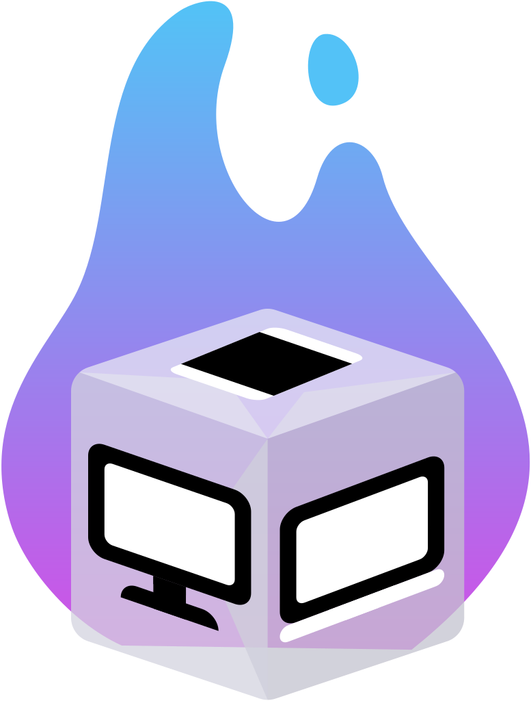

<p align="center">
    
</p>
<h1 align="center"> Sublimation </h1>

Share your local development server easily with your Apple devices.

[](https://swift.org)
[](http://twitter.com/brightdigit)


[](https://swiftpackageindex.com/brightdigit/Sublimation)
[](https://swiftpackageindex.com/brightdigit/Sublimation)


<!--
[](https://codecov.io/gh/brightdigit/Sublimation)
-->
[](https://www.codefactor.io/repository/github/brightdigit/Sublimation)
[](https://codebeat.co/projects/github-com-brightdigit-Sublimation-main)
[](https://codeclimate.com/github/brightdigit/Sublimation)
[](https://codeclimate.com/github/brightdigit/Sublimation)
[](https://codeclimate.com/github/brightdigit/Sublimation)
[](https://houndci.com)

# Table of Contents

* [Introduction](#introduction)
   * [Requirements](#requirements)
   * [Using Ngrok](#using-ngrok)
   * [Using the Cloud for Meta-Server Access](#using-the-cloud-for-meta-server-access)
* [Features](#features)
* [Installation](#installation)
   * [Cloud Setup](#cloud-setup)
   * [Server Installation](#server-installation)
   * [Client Installation](#client-installation)
* [License](#license)

# Introduction

When you are developing a full stack Swift application, you want to easily test and debug your application on both the device (iPhone, Apple Watch, iPad, etc...) as well as your development server. If you are using simulator then setting your host server to `localhost` will work but often we need to test on an actual device. You can either be an IT expert your local network's DNS or you can use Sublimation to easily connect your local server to your device.

## Requirements 

**Apple Platforms**

- Xcode 13.3 or later
- Swift 5.5.2 or later
- iOS 14 / watchOS 6 / tvOS 14 / macOS 12 or later deployment targets

**Linux**

- Ubuntu 18.04 or later
- Swift 5.5.2 or later

## Using Ngrok

Ngrok is a fantastic service for setting up local development server for outside access. Let's say you need to share your local development server because you're testing on an actual device which can't access your machine via your local network. You can run `ngrok` to setup an https address which tunnels to your local development server:

```bash
> vapor run serve -p 1337
> ngrok http 1337
```
Now you'll get a message saying your vapor app is served through ngrok:

```
Forwarding https://c633-2600-1702-4050-7d30-cc59-3ffb-effa-6719.ngrok.io -> http://localhost:1337 
```

Great! So how can I make sure my app uses that address for the host name?

* Hard Code It! 
* Parse Environment Variable?
* Magic?

That's where Sublimation comes in...

## Using the Cloud for Meta-Server Access

With Sublimation you save the address (such as `https://c633-2600-1702-4050-7d30-cc59-3ffb-effa-6719.ngrok.io`) to a key-value storage and pull that address from your Apple device during development.

# Installation

Sublimation has two components: Server and Client. You can check out the SublimationDemoApp Xcode project for an example. Before setting up our server and client app, let's setup our key-value storage.

## Cloud Setup

If you haven't already setup an account with ngrok and install the command-line tool via homebrew. Next let's setup a key-value storage with kvdb.io which is currently supported. _If you have another service, please create an issue in the repo. Your feedback is helpful._ 

Sign up at kvdb.io and get a bucket name you'll use. You'll be using that for your setup. Essentially there are three components you'll need:

* path to ngrok on your machine - if you installed via homebrew it's `/opt/homebrew/bin/ngrok` but you can find out using: `which ngrok` after installation
* your kvdb.io bucket name 
* your kvdb.io key - you just need to pick something unique for your server and client to use

Now let's setup your Vapor server application...
## Server Installation

To integrate **Sublimation** into your Vapor app using SPM, specify it in your Package.swift file:

```swift    
let package = Package(
  ...
  dependencies: [
    .package(url: "https://github.com/brightdigit/Sublimation.git", from: "0.1.0")
  ],
  targets: [
      .target(
          name: "YourVaporServerApp",
          dependencies: [
            .product(name: "SublimationVapor", package: "Sublimation"), ...
          ]),
      ...
  ]
)
```

`SublimationVapor` is the product which gives us the `SublimationLifecycleHandler` we'll use to integrate `Sublimation` with your Vapor app. Simply add `SublimationLifecycleHandler` to your application:

```swift
let app = Application(env)
...
app.lifecycle.use(
  SublimationLifecycleHandler(
    ngrokPath: "/opt/homebrew/bin/ngrok",
    bucketName: "bucket-name",
    key: "application key name"
  )
)
```

This will run `ngrok` and setup the forwarding address. Once it receives the address it saves it your kvdb bucket with key setup here.

Remember the ngrok path is the path from your development machine while the bucket name is from kvdb.io. However, the key can be anything you want as long as it's consistent and used by your client. Speaking of your client, let's talk about setting this up in your iOS app.

## Client Installation

In your Xcode project, add the swift package for Sublimation at:

```
https://github.com/brightdigit/Sublimation.git
```

In your application target, you only need a reference to the `Sublimation` library. 

Now to pull the url saved by your service, all you have to call is:

```swift
import Sublimation

let baseURL = try await KVdb.url(withKey: key, atBucket: bucketName)
```

At the point, you'll have the base url of your Vapor application and can begin using it in your application!
# License 

This code is distributed under the MIT license. See the [LICENSE](https://github.com/brightdigit/Sublimation/LICENSE) file for more info.
