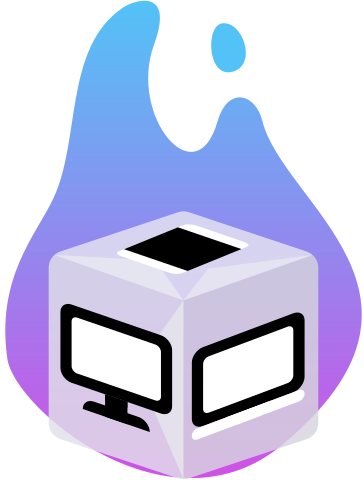
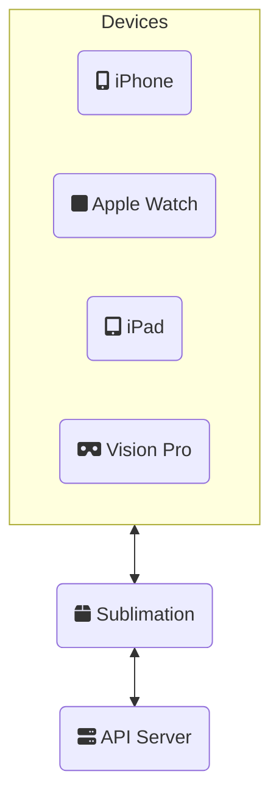
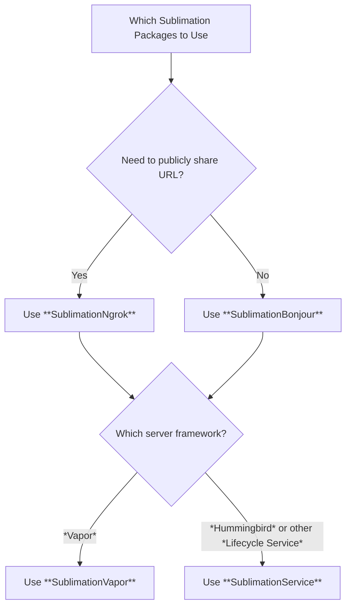

<p align="center">
    
</p>
<h1 align="center"> Sublimation </h1>

Enable **automatic discovery of your local development server** on the fly

Turn your Server-Side Swift app from a _mysterious vapor_ to a **tangible solid server**

[](https://swiftpackageindex.com/brightdigit/Sublimation/documentation)
[](https://swift.org)
[](http://twitter.com/brightdigit)


[](https://swiftpackageindex.com/brightdigit/Sublimation)
[](https://swiftpackageindex.com/brightdigit/Sublimation)

[](https://codecov.io/gh/brightdigit/Sublimation)
[](https://www.codefactor.io/repository/github/brightdigit/Sublimation)
[](https://codebeat.co/projects/github-com-brightdigit-Sublimation-main)
[](https://codeclimate.com/github/brightdigit/Sublimation)
[](https://codeclimate.com/github/brightdigit/Sublimation)
[](https://codeclimate.com/github/brightdigit/Sublimation)

# Table of Contents

* [Introduction](#introduction)
  * [Requirements](#requirements)
* [Package Ecosystem](#package-ecosystem)
* [Usage](#usage)
* [Documentation](#documentation)
* [License](#license)

<!-- Created by https://github.com/ekalinin/github-markdown-toc -->

# Introduction
   
When you are developing a Full Stack Swift application, you want to easily test and debug your application on both the device (iPhone, Apple Watch, iPad, etc...) as well as your development server. If you are using simulator then setting your host server to `localhost` this may work but often you need to test on an actual device. 

For the server and client **we need a way to communicate that information** without the client knowing where the server is initially.



## Requirements 

**Apple Platforms**

- Xcode 16.0 or later
- Swift 6.0 or later
- iOS 17 / watchOS 10.0 / tvOS 17 / macOS 14 or later deployment targets

**Linux**

- Ubuntu 20.04 or later
- Swift 6.0 or later

For **older operating systems or Swift versions**, check out [the main branch and 1.0.0 releases](https://github.com/brightdigit/Sublimation).

# Package Ecosystem

| Repository                                                 | Description                                        |
| ----------                                                 | -----------                                        |
| [**SublimationBonjour**](https://github.com/brightdigit/SublimationBonjour) | `Sublimatory` for using [Bonjour](https://developer.apple.com/bonjour/) for auto-discovery for development server.                      |
| [**SublimationNgrok**](https://github.com/brightdigit/SublimationNgrok) | `Sublimatory` for using [Ngrok](https://ngrok.com/) and [KVdb](https://kvdb.io) to create public urls and share them.   |
| [**SublimationService**](https://github.com/brightdigit/SublimationService) | Use **Sublimation** as a [Lifecycle Service](https://github.com/swift-server/swift-service-lifecycle).   |
| [**SublimationVapor**](https://github.com/brightdigit/SublimationVapor) |   Use **Sublimation** as a [Vapor Lifecycle Handler](https://docs.vapor.codes/advanced/services/#lifecycle).      |



To use **Sublimation**, you'll need to choose:

* **Sublimatory**, that is the method by which you advertise the development server
  * [**Bonjour**](https://developer.apple.com/bonjour/) via [SublimationBonjour](https://github.com/brightdigit/SublimationBonjour)  
  * [**Ngrok**](https://ngrok.com/) via [SublimationNgrok](https://github.com/brightdigit/SublimationBonjour) _which is only needed if you need to advertise your address publicaly_ 
* How it connects to the server
  * [Lifecycle Handler for Vapor](https://docs.vapor.codes/advanced/services/#lifecycle) via [SublimationVapor](https://github.com/brightdigit/SublimationBonjour)
  * [Lifecycle Service](https://github.com/swift-server/swift-service-lifecycle) via [SublimationService](https://github.com/brightdigit/SublimationBonjour) _for server frameworks such as [Hummingbird](https://docs.hummingbird.codes/2.0/documentation/hummingbird/)_

# Usage

For instance if you were using **Bonjour** with **Hummingbird** and an iOS app your package may look something like this:

```swift
let package = Package(
  ...
  dependencies: [
    .package(url: "https://github.com/hummingbird-project/hummingbird.git", from: "2.0.0-alpha.1"),
    .package(url: "https://github.com/brightdigit/SublimationBonjour.git", from: "1.0.0"),
    .package(url: "https://github.com/brightdigit/SublimationService.git", from: "1.0.0")
  ],
  targets: [

      .target(
          name: "YouriOSApp",
          dependencies: [
            .product(name: "SublimationBonjour", package: "SublimationBonjour"),
            ...
          ]),
      ...
      .target(
          name: "YourServerApp",
          dependencies: [
            .product(name: "Hummingbird", package: "hummingbird"),
            .product(name: "SublimationBonjour", package: "SublimationBonjour"),
            .product(name: "SublimationService", package: "SublimationService"), 
            ...
          ]),
      ...
  ]
)
```

If you were to use **Vapor** and **Ngrok** instead, it'd look more like this:

```swift
let package = Package(
  ...
  dependencies: [
    .package(url: "https://github.com/vapor/vapor.git", from: "4.76.0"),
    .package(url: "https://github.com/brightdigit/SublimationNgrok.git", from: "1.0.0"),
    .package(url: "https://github.com/brightdigit/SublimationVapor.git", from: "1.0.0")
  ],
  targets: [

      .target(
          name: "YouriOSApp",
          dependencies: [
            .product(name: "SublimationKVdb", package: "SublimationNgrok"),
            ...
          ]),
      ...
      .target(
          name: "YourServerApp",
          dependencies: [
            .product(name: "Vapor", package: "vapor"),
            .product(name: "SublimationNgrok", package: "SublimationNgrok"),
            .product(name: "SublimationVapor", package: "SublimationVapor"), 
            ...
          ]),
      ...
  ]
)
```

* _[Why KVdb for the app?](https://github.com/brightdigit/SublimationNgrok#client-setup)_

Please check the respective package documentation from the [Package Ecosystem](#package-ecosystem) section.

# Documentation

To learn more, check out the full [documentation](https://swiftpackageindex.com/brightdigit/Sublimation/2.0.0-beta.1/documentation/sublimation).

# License 

This code is distributed under the MIT license. See the [LICENSE](https://github.com/brightdigit/Sublimation/LICENSE) file for more info.
