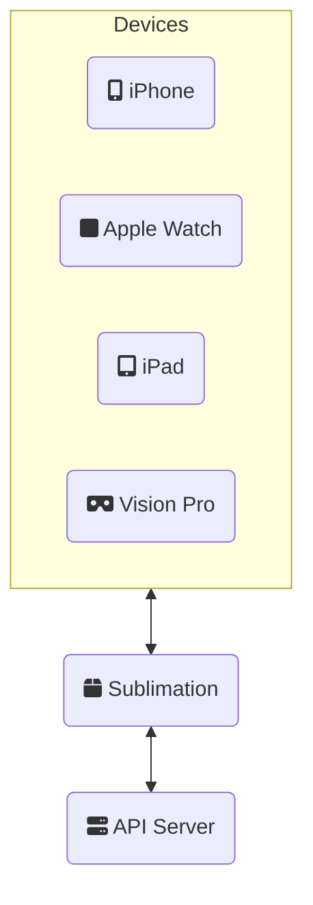

# ``Sublimation``

Enable automatic discovery of your local development server on the fly by turning your server-side swift app from a mysterious vapor to a tangible solid server to connect to.

## Overview

When you are developing a full stack Swift application, you want to easily test and debug your application on both the device (iPhone, Apple Watch, iPad, etc...) as well as your development server. If you are using simulator then setting your host server to `localhost` will work but often we need to test on an actual device. 

For the server and client we need a way to communicate that information without the client knowing where the server is initially.

There's two ways to do this - have a consistent location for fetching the address or a way to discover the service on the network.

## Topics

- ``Sublimation``
